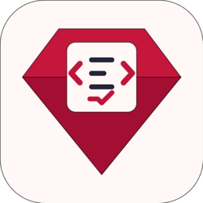

# DragonRuby Intellisense



DragonRuby Intellisense provides Ruby completions and snippets for DragonRuby GTK APIs in Visual Studio Code.

## Features

- API completions for common `args` namespaces, GTK, geometry, grids, easing, arrays, and other DragonRuby helpers.
- Editable snippet placeholders for API calls that take arguments, plus output-queue append templates.
- Completions for indexed output/render-target expressions such as `args.outputs[:scene].sprites.`.
- Hover descriptions and signature help for documented completion items.
- An optional, workspace-local scan for API calls documented in a DragonRuby engine checkout.
- A **DragonRuby: Run Game** debug configuration for projects with the `dragonruby` executable in the workspace root.

Completions are available in Ruby files after typing a period, for example `args.geometry.` or `args.outputs.`. Press `Ctrl+Space` (or the platform equivalent) for general code snippets.

## Workspace API scan

On first activation, you can opt in to scan the workspace for additional DragonRuby API completions. Results are saved separately for each workspace. To scan again, run **DragonRuby: Scan Workspace for Missing API Calls** from the Command Palette.

## Requirements

- Visual Studio Code.
- A Ruby project using DragonRuby GTK to make the API completions useful.
- For the debug configuration, place the `dragonruby` executable in the workspace root.

## Known limitations

- DragonRuby APIs vary by engine version. Built-in suggestions reflect the API data maintained in this extension; the optional scan only discovers recognizable calls in workspace documentation.
- Hover and signature help are based on completion metadata and may not describe every overload.
- This extension does not execute or validate Ruby or DragonRuby code.

## Development

### Getting started

After installing Node.js (which includes npm), open a terminal in the project folder and run:

```sh
npm install
npm test
```

`npm install` downloads the tools needed for development. `npm test` checks the code and runs the tests in Visual Studio Code. The test command may download VS Code the first time.

To try the extension while developing, open the project in Visual Studio Code and press **F5**.
